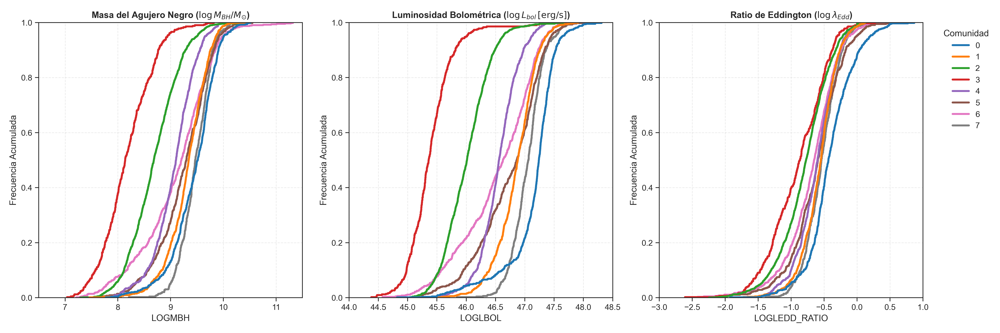

# Topología del Espacio Latente Fotométrico: Taxonomía No Supervisada de Cuásares


## 📖 Abstract / Descripción

Este proyecto presenta un pipeline de Machine Learning **completamente no supervisado** diseñado para el análisis topológico y la clasificación taxonómica de Cuásares (Núcleos Galácticos Activos - AGNs). Utilizando **exclusivamente datos fotométricos**, este repositorio demuestra que es posible redescubrir la taxonomía compleja de los AGNs y posiblemente aislar poblaciones anómalas.

A través del mapeo topológico y del espacio latente de sus colores fotométricos, el proyecto prescinde por completo de la necesidad de espectroscopía previa o etiquetas de entrenamiento, revelando eficazmente la estructura subyacente de la población de cuásares a partir del *manifold* de sus observaciones en múltiples bandas.

## ⚙️ Arquitectura del Pipeline

El ciclo de vida del análisis se articula en tres etapas fundamentales:

### 1. Preprocesamiento Físico
- **Unificación de Sistemas Fotométricos:** Armonización de las bandas observacionales (GALEX, 2MASS, WISE y UKIDSS) al ecosistema global de magnitudes AB, asegurando un manifold físicamente coherente en todas sus fronteras espectrales.
- **K-Correction:** Cálculo de magnitudes absolutas rest-frame aplicando corrección basada en templates empíricos compuestos de cuásares (ej. Vanden Berk et al. 2001, Selsing et al. 2016), lidiando de forma robusta con la inmensa dispersión en redshift ($z$).
- **Imputación Inteligente:** Manejo físico-matemático de flujos fotométricos negativos o nulos para prevenir sesgos de supervivencia (*survival bias*), revelando poblaciones ocultas por fuerte oscurecimiento intrínseco.
- **Transformación de Dimensionalidad:** Construcción del espacio original de características basado en índices de color.

### 2. Modelado Topológico
- **Reducción de Dimensionalidad (UMAP):** Proyección matemática utilizando el algoritmo *Uniform Manifold Approximation and Projection*. Se calibró específicamente con la métrica de Manhattan ($L_1$), confiriendo al modelo una **alta robustez estructural frente a outliers astrofísicos** extremos que abundan en los catálogos observacionales.

### 3. Aprendizaje sobre Grafos (*Graph Learning*)
- **Construcción del Grafo:** Formulación de un grafo de similitud k-NN, finamente ponderado mediante un Heat Kernel (Gaussiano) que promueve transiciones analíticas suaves en todo el manifold fotométrico.
- **Clustering Topológico:** Implementación del Clustering Espectral, estabilizando el tejido de datos subyacente en 8 comunidades distintas.

---

## 🔬 Hallazgos y Resultados de Validación

La clusterización espectral sobre el manifold, evaluada y optimizada utilizando la métrica de **Modularidad (Q)**, estabilizó la topología en **8 comunidades distintas** ($Q \approx 0.86$). El análisis jerárquico de los regímenes de emisión (IR, Óptico y UV) demostró que el modelo redescubre exitosamente la taxonomía astrofísica clásica de los núcleos activos:

- **Cuásares Estándar (Comunidades 1 y 4):** Población de referencia dominada por emisión sincrotrón/disco óptica y continuo UV impecable, libre de contaminación o extinción.
- **AGNs Enrojecidos / Oscurecidos (Comunidades 2 y 6):** Sub-poblaciones caracterizadas por un robusto exceso térmico infrarrojo (dominancia del toroide) y atenuación estadísticamente significativa de las bandas ópticas.
- **AGNs Diluidos por su Galaxia / Seyferts (Comunidades 3 y 5):** Población marginal donde la emisión del núcleo activo decae frente al flujo estelar de la galaxia anfitriona, alterando el índice W1-W2.
Estos hallazgos demuestran la viabilidad de inferir propiedades intrínsecas complejas sin mediar espectroscopía previa.

### 📊 Validación Espectroscópica Independiente

Para corroborar rigurosamente la naturaleza causal de estos clústeres latentes puramente fotométricos, la partición fue contrastada *a posteriori* utilizando propiedades espectrales (completamente ignoradas por las fases previas del Pipeline). 

Las pruebas no paramétricas globales de **Kruskal-Wallis** confirmaron diferencias estadísticamente significativas ($p$-valor $\to 0$) a través de toda la taxonomía encontrada en dimensiones clave del Núcleo Activo:
- Escala del Motor Central: Masa del Agujero Negro Supermasivo (`LOGMBH`), Luminosidad Bolométrica (`LOGLBOL`) y la Tasa de Eddington (`LOGLEDD_RATIO`).
- Cinemática del *Broad Line Region* (BLR): Anchuras equivalentes (EW) y FWHM de flujos iónicos masivos (`CIV`, `MgII`, `H-Beta`).



El consecuente análisis *post-hoc* empleando la métrica computacional **Delta de Cliff ($|d|$)** expuso tamaños de efecto (effect sizes) inmensos entre ciertas comunidades segregadas, demostrando matemáticamente que la topología fotométrica descubierta está inequívocamente anclada a las variables fundamentales y termodinámicas del AGN.

## 📁 Estructura del Proyecto

```text
Network-Analysis-of-Quasars/
├── data/                  # Datasets fotométricos, metadata y catálogos (SDSS DR16Q)
├── docs/                  # Documentación teórica, diagramas y artículos de referencia
├── notebooks/             # Workspace iterativo para EDA y modelamiento
│   ├── photometric_cleaning.ipynb   # Limpieza, armonización fotométrica (AB) y K-corrections
│   ├── photometric_analisis.ipynb   # Análisis exploratorio profundo (EDA) de colores fotométricos
│   ├── photometric_graph.ipynb      # Grafo k-NN, reducciones UMAP y extración topológica (Leiden)
│   └── spectroscopic_analisis.ipynb # Contraste y validación causal usando propiedades espectroscópicas
├── results/               # Salidas de clusters, métricas, gráficas y embeddings
├── scripts/               # Scripts de ejecución modularizada
│   └── data_merge.py      # Cruce posicional de tablas fotométricas/espectroscópicas
├── venv/                  # Entorno virtual local (ignorado en git)
├── requirements.txt       # Control de dependencias de Python
└── README.md              # Este archivo
```

---

## 🛠️ Instalación y Requisitos

Para replicar el entorno de ejecución aislando los paquetes de análisis (como `umap-learn`, `igraph`, `leidenalg`, `astropy`, etc.):

```bash
# 1. Clonar este repositorio
git clone https://github.com/tu-usuario/Network-Analysis-of-Quasars.git
cd Network-Analysis-of-Quasars

# 2. Crear y activar tu entorno virtual
python -m venv venv

# En Linux o macOS:
source venv/bin/activate
# En Windows:
venv\Scripts\activate

# 3. Instalar las dependencias exactas del proyecto
pip install -r requirements.txt
```
